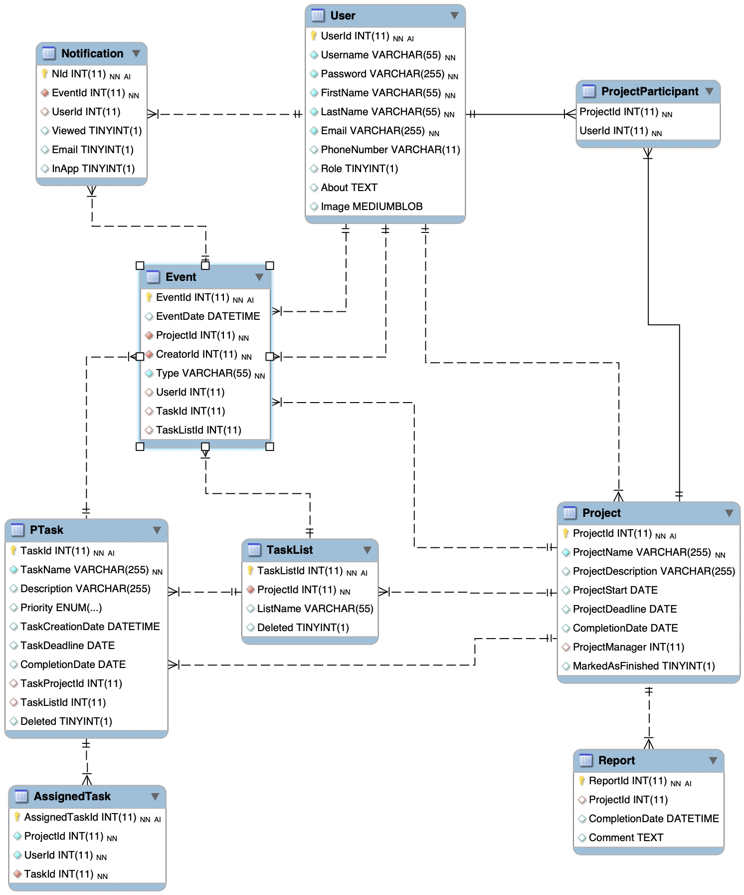

# Workflow web application

Group project developing a "Workflow Management System" for the course "Application Development", spring 2019.

The system, "Workflow", consist of a web application where users (employees) can view and manage their own workflow, and a desktop application for administrators to manage projects tasks and assets. This repository contains the web application part of the project.

## Demo

## Technologies Used

- ASP.NET Core 2.2 https://docs.microsoft.com/en-us/aspnet/core/?view=aspnetcore-2.2
  - MVC with Razor Pages https://docs.microsoft.com/en-us/aspnet/mvc/overview/getting-started/introduction/adding-a-view
  - Bootstrap v4
  - jQuery v3
  - Font Awesome v5
- Entity Framework Core 8.0.15 https://docs.microsoft.com/en-us/ef/
  - MySQL

## ER model Database

